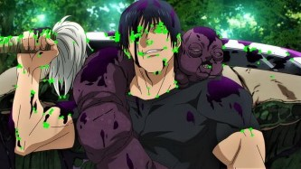
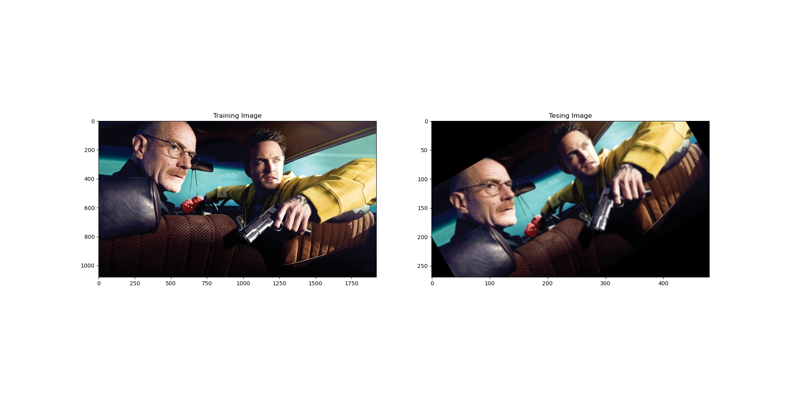
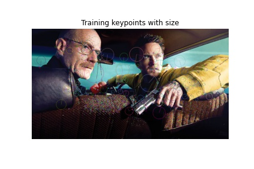
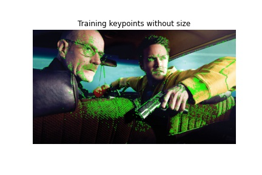
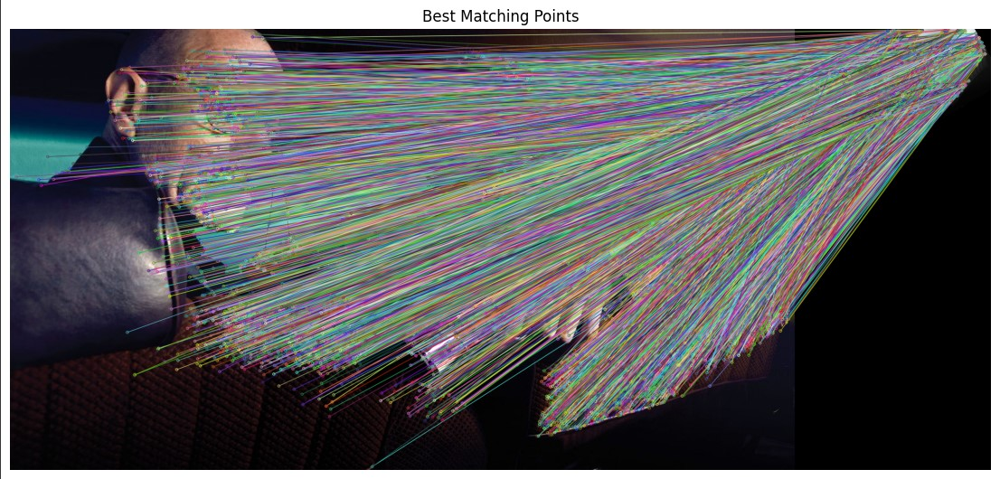
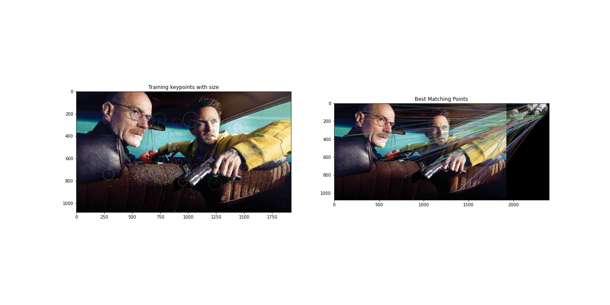

# Digital-Image-Processing
I will be updating the things I learn about Digital Processing here :)

## Harris Corner Detection
Add about Harris Corner Detection. 
Below image is the original image    
 

Below image is the one with the corners in it.    
 

## SIFT (Scale Invariant Feature Transform)
Write the about the SIFT algo and the 4 main steps. 
Below are the train and test images  

 

The testing image has been rotated by an angle of 30 degress with respect to the center and the scaling factor used was 1 (no scaling)  

Below are the training images of keypoints with and without size respectively.  

 
 

Below are the matching keypoints of the training image and the testing image 
 

For easy visualization only a few keypoints were matched in the image shown below
 
