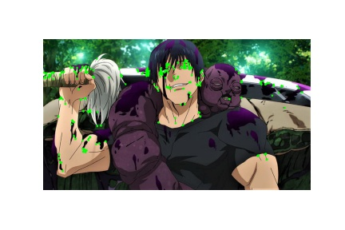

# Digital-Image-Processing
I will be updating the things I learn about Digital Processing here :)

## Harris Corner Detection
Add about Harris Corner Detection. 
Below image is the original image  
 
 

Below image is the one with the corners in it.  
 

